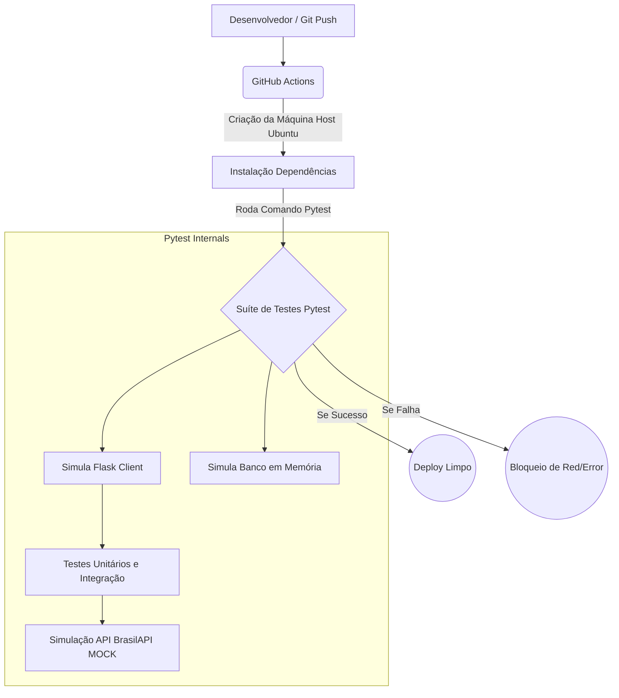

# Explicação Técnica: Testes Automatizados e CI no Flask

Este documento detalha o que foi desenvolvido na branch `deploy` para cumprir o requisito acadêmico governado por **Integração Contínua e Testes Automatizados**. Utilize este material como roteiro e base teórica para a sua apresentação final na faculdade.

## 1. Visão Geral da Arquitetura

O ecossistema implementado na sua aplicação está dividido em três grandes pilares, trabalhando de forma conjunta para assegurar a confiabilidade do código:



> [!NOTE]
> **Por que fazemos isso?**
> A intenção de ter "Integração Contínua" é garantir que nenhum programador possa enviar códigos defeituosos ou não otimizados para o servidor em produção. Todo empacotamento deve passar automaticamente por rigorosos testes que garantem as qualidades do sistema e não afetam os bancos de dados reais.

---

## 2. Configuração Dinâmica do Banco de Dados
A sua aplicação Flask (`webapp.py`) precisa lidar com **duas dimensões distintas de execução**: uma ligada ao sistema normal com a base real do banco Aiven e a do universo dos nossos testes automatizados. 

Nós utilizamos uma "Variável de Ambiente" de controle de forma engenhosa no código base:
```python
if os.environ.get("TESTING") == "True":
    app.config['SQLALCHEMY_DATABASE_URI'] = 'sqlite:///:memory:' # Execução Leve
else:
    app.config['SQLALCHEMY_DATABASE_URI'] = '{SGBD}://{usuario}... # Execução Real
```

> [!IMPORTANT]
> **Por que usar `sqlite:///:memory:`?**
> Ao fazer este redirecionamento de base durante nossos testes, estamos dizendo para o sistema esquecer temporariamente do MySQL super-robusto e instanciar um banco de dados virtual que reside ***inteiramente na memória de trabalho do servidor (RAM)***. Isso permite que a rotina grave milhares de usuários e os delete durante uma fração de segundos com isolamento completo e agilidade extrema, sem gerar custos de uso no seu banco de nuvem do Aiven e sem bagunçar os registros das contas verdadeiras.

---

## 3. As Engrenagens do Pytest `(tests/conftest.py)`

O arquivo `conftest.py` é o grande motor que prepara as mesas virtuais pro Python atirar seus feitiços de testes, gerando abstrações que chamamos de **Fixtures**:

- `@pytest.fixture`: Decorador que dita funções capazes de alimentar os testes.
- **Fixture `app()`**: Engana o sistema ajustando a máquina dizendo `os.environ["TESTING"] = "True"` – É essa pequena frase que converte o banco de dados pro SQLite memory.
- **Fixture `client()`**: Entrega aos testes uma versão robótica autônoma que usa o `Flask.test_client()`. Esse robô interage com sua plataforma programaticamente simulando um usuário perfeitamente de carne e osso (mandando Posts, chamando rotas, e observando telas Html).

---

## 4. O Coração dos Códigos do Teste `(tests/test_app.py)`

Nossos métodos criados simularam os 3 casos propostos desde a criação do roteiro.

### Teste de Listagem (Validação do Fornecimento de API)
Garante que sua rota `RESTFUL API` fornecedora JSON está realmente operando e cospe código formatado com o protocolo HTTP de Sucesso (200).
```python
def test_api_listar_agendamentos(client):
    resposta = client.get('/api/agendamentos')
    assert resposta.status_code == 200    # Esperamos resposta perfeitamente visível 
    assert resposta.is_json               # Confirmamos formatação do formato esperado JSON.
```

### O Desafio de Mocking (Isolar A "BrasilAPI")
No seu projeto você importou inteligentemente uma API do Brasil para verificação de feriados usando requests na hora de agendar dias para corte, o que é brilhante. Porém, testar conexões com sistemas terceiros dentro do Pytest pode levar lentidão excessiva para a pipeline. Imagine se a sua BrasilAPI entrasse fora do ar lá no Ministério do Governo logo no meio do seu exame CI de Faculdade. Os testes diriam que o **SEU** sistema quebrou injustamente. 

Sendo assim, precisamos aplicar o conceito de **MOCK**:

```python
from unittest.mock import patch

@patch('webapp.requests.get')  # interceptamos o pedido ao lado de fora usando biblioteca nativa 
def test_mocking_holiday_api_agendamentos(mock_get, client, run_banco):
    # Damos o controle para o desenvolvedor 
    mock_get.return_value.status_code = 200 
    mock_get.return_value.json.return_value = [{"date": "2026-10-02", "name": "Hackaton Day"}]
    # A partir daqui não ocorre de fato o request.
```
> [!TIP]
> **Justificativa MOCK:** 
> Na apresentação, defina MOCK como um "Objeto Dublê". Nós criamos um dublê para a biblioteca `requests` que responde com um dado falso controlado e instântaneo em segundos, blindando os nossos recursos se por algum acaso o serviço externo online derramar durante as validações.

---

## 5. A Pipeline na Esteira GitHub Actions

Nossa orquestração de CI, ou Continuous Integration, reside toda armazenada na alma contida pelas raízes ocultas do diretório do projeto: `.github/workflows/main.yml`.

Sempre que a sua Master (ou Deploy Branch neste caso) notar a chegada de uma nova edição sendo atualizada através das veias do protocolo Push que roda na sua ramificação de Git terminal local. Todo este maquinario sobe sob um container Linux na nuvem global do hub remoto do **GitHub Actions**.
Esse script que nós fabricamos não possui um visual, pois sua existência é inteiramente lógica em Linux Ubuntu. Seu script em YAML segue os pilares rigorosos da sintaxe e realiza a orquestração e invocação automatizada dos scripts e ferramentas de Testes na ordem exata e necessária como: instanciar dependência, carregar o banco e executar o core do PyTest antes de retornar o "Sinal Verde."

Se na apresentação o Avaliador perguntar *"Onde é engatilhado tudo isso?"*. Diga categoricamente: _Ele é gerado automaticamente a cada empurrão "Push" pelas configurações da Actions._

Boa sorte no seu projeto!
